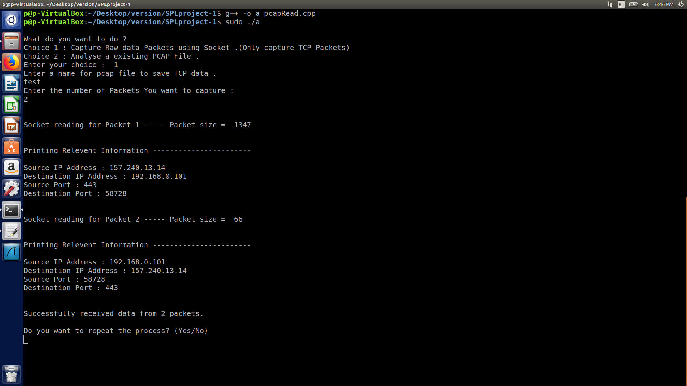
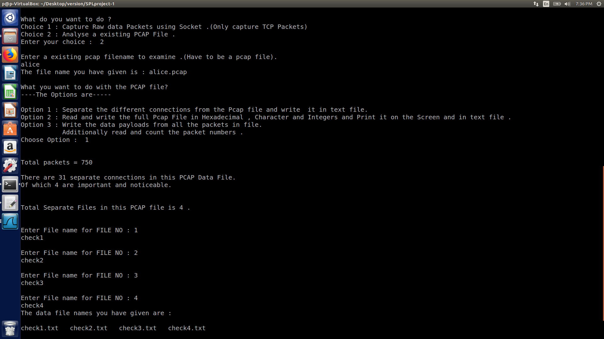
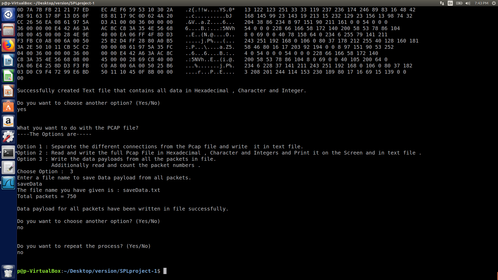

# Text Bandit

[](https://www.linux.com)
[](https://opensource.org/licenses/MIT)


[](https://java-lang.github.io/awesome-java)

---

### Table of Contents

- [About The Project](#about-the-project)
- [Features and Architecture](#Features-and-Architecture)
- [Project Demo](#project-demo)
- [Main Project Files](#main-project-files)
- [License](#license)
- [Author Info](#author-info)

---

## About The Project


This program is used to steal data from open HTTP connection in any network. We just need to be present in the network to steal it!
Working procedures:
1. First the pcapCapture.cpp is called to capture the data in an open HTTP connection. It captures all the packets sending and receving in the connection. Then it writes all the packets in a user-specified file.
2. After caputuring the files the pcapAnalyze.cpp is called. It analyzes the packets gathers all the packets from the same connection in order. Then we can save the result in a user-specfied file and see the results. Thus the steal is complete!
3. After that the data packets are sorted according to their source IP adress, destination IP adress, source port number, destination port number. Then the packets are placed according to the sequence number.


[](#Text-Bandit)

---

## Features and Architecture

### Features

- Terminal Program
- Capture data packets
- Store data packets
- Analyze the packets
- Check if there are any open HTTP connection in the network.
---

### Application Architecture

- OS: Linux
- Language: C, C++
- IDE: Visual Studio Code
- Libraries: sys/socket.h

[](#Text-Bandit)

---

## Project Demo

### Member Application Screenshots

---

<table style="width:100%">
  <tr>
    <th>Output Page 1</th>
  </tr>
  <tr>
    <td></td>
  </tr>
  <tr>
    <th>Output Page 2</th>
  </tr>
  <tr>
    <td></td>
  </tr>
  <tr>
    <th>Output Page 3</th>
  </tr>
  <tr>
    <td></td>
  </tr>
  <tr>
    <th>Output Page 4</th>
  </tr>
  <tr>
    <td></td>
  </tr>
  
</table>

[](#Text-Bandit)

---

## Main Project Files
*For detailed project code overview go inside the "Code" folder or click [here](https://github.com/PritomKumar/SPLproject-1/tree/master/Code).*


[](#Text-Bandit)

---

## License

```
MIT License

Copyright (c) 2021 PritomKumar

Permission is hereby granted, free of charge, to any person obtaining a copy
of this software and associated documentation files (the "Software"), to deal
in the Software without restriction, including without limitation the rights
to use, copy, modify, merge, publish, distribute, sublicense, and/or sell
copies of the Software, and to permit persons to whom the Software is
furnished to do so, subject to the following conditions:

The above copyright notice and this permission notice shall be included in all
copies or substantial portions of the Software.

THE SOFTWARE IS PROVIDED "AS IS", WITHOUT WARRANTY OF ANY KIND, EXPRESS OR
IMPLIED, INCLUDING BUT NOT LIMITED TO THE WARRANTIES OF MERCHANTABILITY,
FITNESS FOR A PARTICULAR PURPOSE AND NONINFRINGEMENT. IN NO EVENT SHALL THE
AUTHORS OR COPYRIGHT HOLDERS BE LIABLE FOR ANY CLAIM, DAMAGES OR OTHER
LIABILITY, WHETHER IN AN ACTION OF CONTRACT, TORT OR OTHERWISE, ARISING FROM,
OUT OF OR IN CONNECTION WITH THE SOFTWARE OR THE USE OR OTHER DEALINGS IN THE
SOFTWARE.

```

[](#Text-Bandit)

---

## Author Info

- Linkedin - [Linked In](https://www.linkedin.com/in/pritomkumar/fr)
- Website - [Pritom Kumar Das](https://sites.google.com/view/pritom-kumar-das/)

[](#Text-Bandit)
